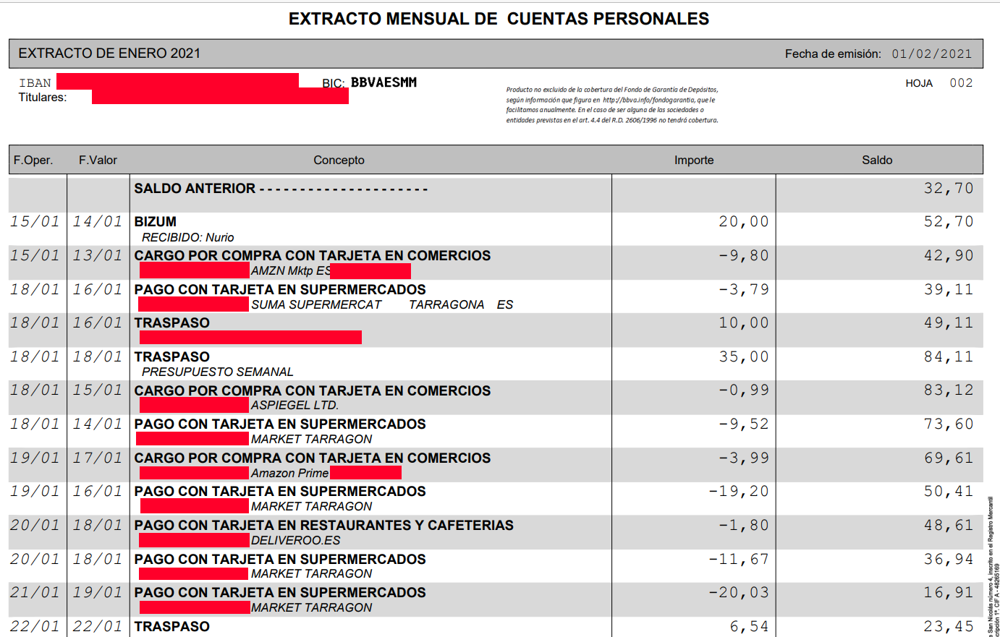

# BBVA monthly statement to CSV



```csv
OPERATION DATE|VALUE DATE|OPERATION TYPE|DESCRIPTION|AMOUNT|BALANCE
15/01/2021|14/01/2021|BIZUM|RECIBIDO: NURIO|20.00|52.70
15/01/2021|13/01/2021|CARGO POR COMPRA CON TARJETA EN COMERCIOS|???????????????? AMZN MKTP ES*???????????|-9.80|42.90
18/01/2021|16/01/2021|PAGO CON TARJETA EN SUPERMERCADOS|???????????????? SUMA SUPERMERCAT TARRAGONA ES|-3.79|39.11
18/01/2021|16/01/2021|TRASPASO|????????????????????????????????????????????|10.00|49.11
18/01/2021|18/01/2021|TRASPASO|PRESUPUESTO SEMANAL|35.00|84.11
18/01/2021|15/01/2021|CARGO POR COMPRA CON TARJETA EN COMERCIOS|???????????????? ASPIEGEL LTD.|-0.99|83.12
18/01/2021|14/01/2021|PAGO CON TARJETA EN SUPERMERCADOS|???????????????? MARKET TARRAGON|-9.52|73.60
19/01/2021|17/01/2021|CARGO POR COMPRA CON TARJETA EN COMERCIOS|???????????????? AMAZON PRIME*???????????|-3.99|69.61
19/01/2021|16/01/2021|PAGO CON TARJETA EN SUPERMERCADOS|???????????????? MARKET TARRAGON|-19.20|50.41
20/01/2021|18/01/2021|PAGO CON TARJETA EN RESTAURANTES Y CAFETERIAS|???????????????? DELIVEROO.ES|-1.80|48.61
20/01/2021|18/01/2021|PAGO CON TARJETA EN SUPERMERCADOS|???????????????? MARKET TARRAGON|-11.67|36.94
21/01/2021|19/01/2021|PAGO CON TARJETA EN SUPERMERCADOS|???????????????? MARKET TARRAGON|-20.03|16.91
22/01/2021|22/01/2021|TRASPASO|????????????????????????????????????????????|6.54|23.45
```

# Usage for users
```bash
java -jar bbva.pdftocsv-1.0-SNAPSHOT.jar filetoconvert.pdf [destination.csv]
```

# Usage for developers

```java
File pdfFile = new File("path-to-pdf-statements.pdf");
InputStream inputStream = new FileInputStream(pdfFile);

List<String> csvLines = BbvaPdfToCsv.process(inputStream);
```
